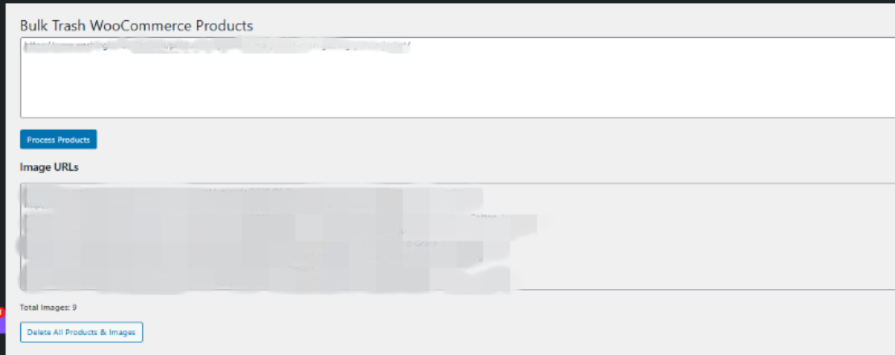

# 🗑️ WooCommerce Bulk Trash Products by URL

A powerful admin tool to **bulk trash WooCommerce products using URLs** — including **permanent deletion of associated images**.

---

## 🚀 Why This Plugin?

Managing large WooCommerce stores can get messy — especially when:

- ❌ Products need to be removed in bulk
- 🖼️ Images remain in media library
- 🧹 Manual cleanup is too slow

This plugin solves that by allowing you to:
👉 Paste product URLs → Preview images → Delete everything in one click

---

## ✨ Features

- 🔗 Input product URLs (one per line)
- 📦 Automatically detects product IDs
- 🖼️ Lists all associated image URLs
- 🔢 Shows total image count
- 🗑️ Bulk trash products
- 💥 Permanently deletes:
- Featured images
- Gallery images
- ⚡ Fast & efficient

---

## 📸 Screenshots

### Admin View

---

## ⚙️ Installation

1. Upload plugin to:
   /wp-content/plugins/woo-bulk-trash-products
2. Activate plugin
3. Go to:
  WordPress Admin → Bulk Trash Products

---

## 🧠 How It Works

1. Paste product URLs (one per line)
2. Click **Process Products**
3. Plugin will:
- Extract product IDs
- List all associated images
- Show total count
4. Click **Delete All Products & Images**
5. Products are moved to trash, images are permanently deleted

---

## ⚠️ IMPORTANT WARNING

- ⚠️ This action is **destructive**
- 🗑️ Images are **permanently deleted**
- 📦 Products are **moved to trash (not permanently deleted)**

👉 Always take a **backup before use**

---

## 💡 Use Cases

- Cleaning imported product data
- Removing outdated collections
- Bulk deleting test/staging products
- Media library cleanup

---

## 🛠️ Tech Stack

- PHP (WordPress Plugin Development)
- WooCommerce API
- WordPress Media Handling

---

## 🔮 Future Improvements

- Bulk delete permanently (skip trash)
- Dry-run preview mode
- Filter by category or tag
- Progress bar for large batches
- Export report before deletion

---

## 👨‍💻 Author

**Muhammad Faisal**  
Full Stack Developer (Laravel & WordPress)

📧 mffaisal877@gmail.com  
🔗 https://linkedin.com/in/muhammad-faisal-a618731b1  

---

## ⭐ Support

If you find this useful, consider giving it a ⭐ on GitHub!
